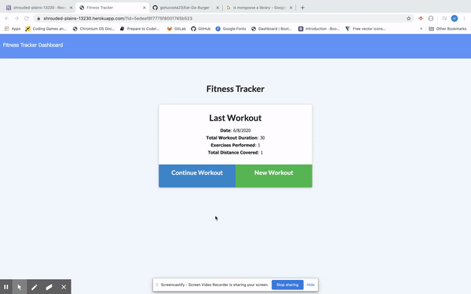
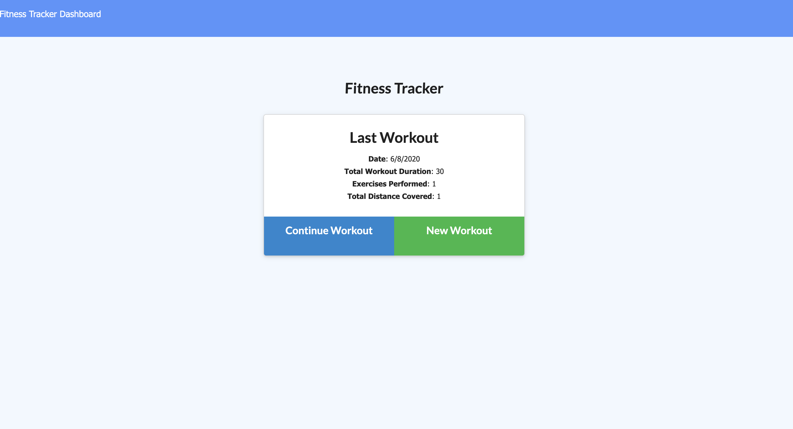
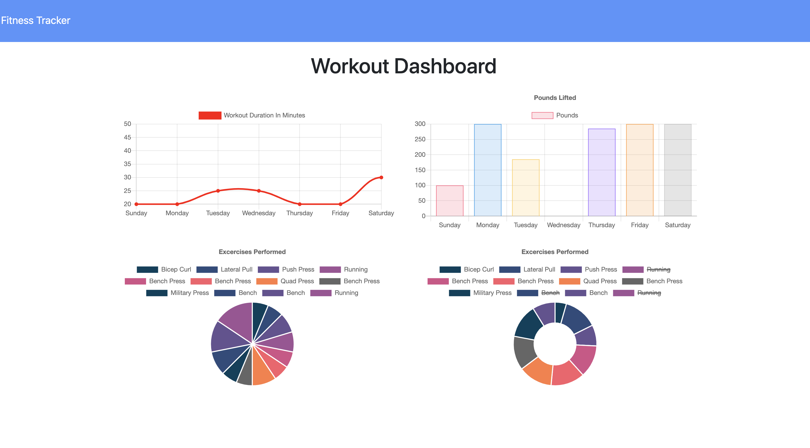
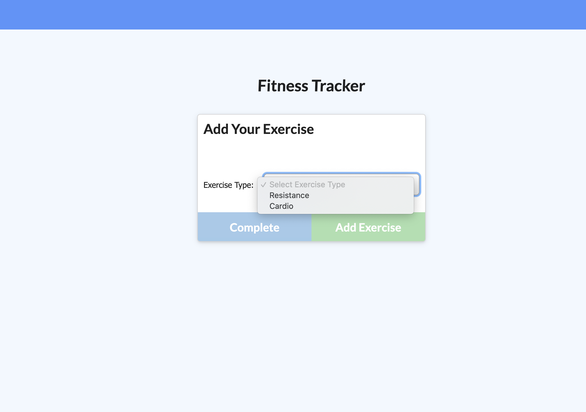

# FITNESS TRACKER
 

## Description
 

This is a simple application that allows the user to create and view daily workouts, track workouts by name, type, weight, reps, sets, and duration of exercise. Users are able to log multiple exercises in a workout on a given day. If the exercise is a cardio exercise, they should be able to track the distance traveled.

 

 

## Installation
 

The application can be forked or cloned from GITHUB. If you want to take a look at how it works and try it out. Click<a href = "https://stormy-taiga-53566.herokuapp.com/"> here</a> to see in the browser... 

 

## Info

In this application I am using a mongoDB database, and mongoose to limit and put some restriction in our models and database. Also, I am using JavaScript on the front end and back end code, as well as Node.js and Express for the server side code.

 

## Questions
 

Check out the app <a href = "https://stormy-taiga-53566.herokuapp.com/" target = "blank">here...</a> 
<a href = "mailto:gohucosta23@hotmail.com">gohucosta23@hotmail.com</a> 